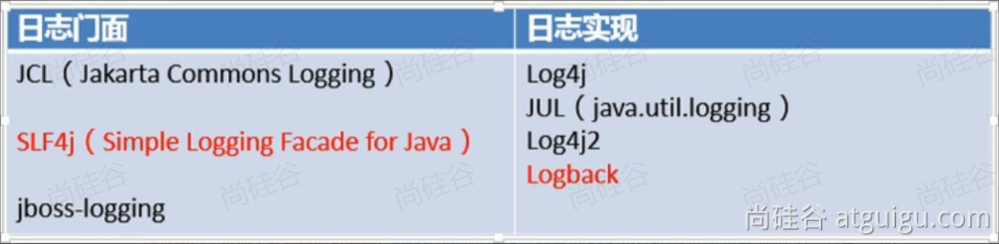

# SpringBoot

最简单的方式，快速整合所有技术栈,SpringBoot 帮我们简单、快速地创建一个独立的、生产级别的 Spring 应用；

•大多数 SpringBoot 应用只需要编写少量配置即可快速整合 Spring 平台以及第三方技术

# 1. 快速入门

- 特性：

- 快速创建独立 Spring 应用

- 直接嵌入Tomcat、Jetty or Undertow

- 提供可选的 starter，简化应用整合

- 按需自动配置 Spring 以及 第三方库

- 提供生产级特性：如 监控指标、健康检查、外部化配置等

- 无代码生成、无xml； 都是基于自动配置技术

总结：

简化开发，简化配置，简化整合，简化部署，简化监控，简化运维


## Springboot简化部署

Springboot可以简化项目的开发,直接建项目,就可以运行,简化了很多步骤, springboot在底层进行了自动配置

在生命周期里也有很多简化的方法,比如打包,清理target包等


项目的jar包导出之后,直接进入cmd窗口 java jar app.jar(app是自定义的包名) 就可以启动服务器

以前在配置文件中才可以修改项目的端口号,可以直接在cmd窗口写java -jar app.jar --server.port=8888, 直接就可以将端口号修改成8888

## 场景启动器

创建项目的时候一顿打钩,就会将相应场景需要的批量的jar包导入到pom配置文件中


官方提供的场景：命名为：spring-boot-starter-*

第三方提供场景：命名为：*-spring-boot-starter

## 依赖管理

为什么 不用写版本号？ maven父子继承，父项目可以锁定版本,如果父项目没管过的依赖,也需要写版本号


如果想修改版本的话,就在子项目写完整的依赖写上版本号,会覆盖掉父项目的版本,

也可以在自己的子项目里写上properties标签,换上需要的版本号


## 自动配置(面试时重要)

**初步理解**

只要把场景启动器启动, 所有底层的东西springboot都会自动配置好,如果能用的,直接@Autowired直接用(如数据源),不能用的改配置文件,或者自己写配置(去spring官网) 

这里有修改底层数据源的举例 p176, 有了springboot就可以直接在配置文件里修改数据源类型了 spring.datasource.type=com.alibaba.druid.pool.DruidDataSource

springboot里面约定大于配置, 因为很多配置都是有默认值的, 只要按照约定来,甚至配置文件里都不需要写配置

spring官网有很多通用的应用配置(p176 12分)

**自动配置的完整流程**

p177 底层的springboot导入原理

场景启动器导入, 就会导入很多的自动配置类, 自动配置类基于@Conditional又导入了很多的组件, 业务就可以使用这些组件了,

自动配置类把组件配置到容器中,把属性类和配置文件进行了绑定, 并且把组件要用的所有属性放到了容器中


# 2.基础功能

## 属性绑定

将容器中任意组件的属性值和配置文件的配置项的值进行绑定

1、给容器中注册组件（@Component、@Bean）

2、使用 @ConfigurationProperties 声明组件和配置文件的哪些配置项进行绑定


在application.properties里添加

```properties
dog.name=旺财
dog.age=12
dog.gender=男
```

建一个属性类properties.DogProperties

```java
@Data
@Component //把组件放入容器中
@ConfigurationProperties(prefix = "dog") //和前缀是dog的绑定
public class DogPropert {
    private String name;
    private Integer age;
    private String gender;
}
```

此时就将属性进行了绑定,在测试类中可以查看信息(这里写中文可能会乱码)

```java
    @Autowired
    DogPropert d;
    @Test
    void contextLoads() throws SQLException {
        System.out.println(d);
    }
}
```


也可以写@EnableConfigurationProperties(DogPropert.class) 在主程序上, 这样不把DogPropert放容器中也可以属性绑定,

注意: 一定是在主程序上, 即使运行是在测试程序


## YAML文件

配置文件不仅可以写properties文件, 还可以写YAML文件

•设计目标，就是方便人类读写

•层次分明，更适合做配置文件

•使用.yaml或 .yml作为文件后缀

新建application.yaml文件

```yaml
spring:
  activemq:
    broker-url:   yaml文件的语法规则  如果要写直后面的东西, 第一个冒号要和前面的属性名之间有个空格
    xxxxx:          对齐的证明是同级的
```

yaml文件层次的辨识度比较高


使用缩进表示层级关系

缩进时不允许使用Tab键，只允许使用空格。换行

缩进的空格数目不重要，只要相同层级的元素左侧对齐即可

(#)表示注释，从这个字符一直到行尾，都会被解析器忽略。

Value支持的写法

对象：键值对的集合，如：映射（map）/ 哈希（hash） / 字典（dictionary）

数组：一组按次序排列的值，如：序列（sequence） / 列表（list）

字面量：单个的、不可再分的值，如：字符串、数字、bool、日期

yaml和properties如果都配置某属性了,互相不冲突,那都生效,如果冲突以properties优先


## banner设置

自定义banner(更换启动时候的logo)

先去配置文件里写(这部可以省略)

```properties
spring.banner.location=classpath:banner.txt
```

之后写一个banner.txt文件在resource文件下

在里面写想要的输出即可

也可也在配置文件写以下内容, 可以关闭banner

```properties
spring.main.banner-mode=off
```


## 启动Spring应用的其他方式

主程序里写的是默认的应用启动方式

```java
SpringApplication.run(Mybatis01HelloworldApplication.class, args);
```

还可以**自定义** SpringApplication

•new SpringApplication

```java
SpringApplication springApplication = new SpringApplication(Mybatis01HelloworldApplication.class);
//中间就可以做一些设置
springApplication.run(args);
```

•new SpringApplicationBuilder

这里可以链式调用

```java
public static void main(String[] args) {
    SpringApplicationBuilder springApplicationBuilder = new SpringApplicationBuilder();
    springApplicationBuilder.main(Mybatis01HelloworldApplication.class);
}
```


## 日志

门面就相当于接口



用SLF4j的Logback实现

### 日志的使用

```java
@Slf4j //自动提供log对象
@SpringBootTest
class Mybatis01HelloworldApplicationTests {
    //Logger logger = LoggerFactory.getLogger(Mybatis01HelloworldApplicationTests.class);//获取一个日志记录器,
    // 一个类的日志记录器只需要获取一次所以写类下面即可 还可以进一步简化直接写注解@slf4j
    @Test
    void contextLoads() throws SQLException {
//       不再使用sout了 System.out.println("=====");
        //Logger logger = LoggerFactory.getLogger(Mybatis01HelloworldApplicationTests.class);//获取一个日志记录器
        log.debug("他是调试日志");
        log.info("他是信息日志");
        log.warn("这是警告日志");
        log.error("这是错误日志");
        log.trace("这是追踪日志");
        //2024-12-13T00:26:51.644+08:00  INFO 3028 --- [mybatis-01-helloworld]
        // [           main] .a.m.Mybatis01HelloworldApplicationTests : 他是信息日志
        //日志的格式:  时间 --级别 --进程id --项目名 --线程名 --当前类名 : 日志的内容
    }
}
```


### 日志级别

级别由低到高

ALL(所有日志),TRACE(追踪), DEBUG(调试),INFO(信息), WARN(警告), ERROR(错误),FATAL(致命错误),OFF(关闭)；

由低到高,越来越粗糙,记录的信息不详细了

日志的默认级别是info, 只会打印他以及他级别之上的信息日志


可以在application.properties文件里修改默认日志级别

```properties
logging.level.root=debug
logging.level.com.atguigu.boot=info 可以设置默认是debug级别,但是com.atguigu级别是info
```

实际在业务的关键点使用可以这样

```java
try{
    //业务关键点
    log.info("信息日志");
}catch (Exception e){
    log.error("错误日志"+e.getMessage());
}
```


### 日志分组

```properties
logging.level.root=info  (默认级别就是info,不写也行)
logging.group.biz=com.atguigu.mybatis01helloworld.bean,com.atguigu.mybatis01helloworld.controller  将这两个包放入分组
logging.level.biz=debug  修改这个组的日志级别
```

注意: springboot有一些自带的组


### 日志的文件输出

目前日志只能打到控制台

SpringBoot 默认只把日志写在控制台，如果想额外记录到文件，可以在application.properties中添加 logging.file.name 或 logging.file.path 配置项

| **logging.file.name** | **logging.file.path** | **示例**   | **效果**                         |
| --------------------- | --------------------- | -------- | ------------------------------ |
| 未指定                   | 未指定                   |          | 仅控制台输出                         |
| **指定**                | 未指定                   | my.log   | 写入指定文件。可以加路径                   |
| 未指定                   | **指定**                | /var/log | 写入指定目录，文件名为spring.log          |
| **指定**                | **指定**                |          | 以logging.file.name为准  ,路径相当于没写 |

指定了**logging.file.name** 就会在当前项目下建立你自定义文件名的文件, 并存储日志

```properties
logging.file.name=boot.log
```

指定**logging.file.path** 可以把存储位置和文件名都指定

```properties
logging.file.path=C://aaa.log
```


### 文件归档与滚动切割

归档：每天的日志单独存到一个文档中。

切割：每个文件10MB，超过大小切割成另外一个文件。

默认**滚动切割**与归档规则如下：

| **配置项**                                                  | **描述**                                                                          |
| -------------------------------------------------------- | ------------------------------------------------------------------------------- |
| logging.**logback**.rollingpolicy.file-name-pattern      | 日志存档的文件名格式  默认值：${LOG_FILE}.%d{yyyy-MM-dd}.%i.gz   ${LOG_FILE}指的是文件名,%i是自增的int值 |
| logging.**logback**.rollingpolicy.clean-history-on-start | 应用启动时是否清除以前存档；默认值：false                                                         |
| logging.**logback**.rollingpolicy.max-file-size          | 每个日志文件的最大大小；默认值：10MB                                                            |
| logging.**logback**.rollingpolicy.total-size-cap         | 日志文件被删除之前，可以容纳的最大大小（默认值：0B）0B不是不存,而是不限制大小。设置1GB则磁盘存储超过 1GB 日志后就会删除旧日志文件         |
| logging.**logback**.rollingpolicy.max-history            | 日志文件保存的最大天数；默认值：7                                                               |

```java
int i =0;
while(true){
log.info("info日志...数字[{}],ok",i++);  i++的值会传到{}里, 这样写不用复杂的拼串, 仅在输出日志的时候可以这么写 {}是占位符
}
```


### 引入框架自己的日志配置文件

可以自己在resource下写一个自己的日志配置文件

p190, 引入自己的配置文件.springboot也有配置文件,以自己引入的为准


### 切换日志实现


通过以上配置,可以切换成log4j2日志配置, 用exclusion排除掉了默认的日志文件,此时就变成了log4j2的日志了


### 总结

我们需要做的配置其实不多,大多数都是了解内容, 

日志输出到文件,打印的日志级别, 

在合适的时候选择合适的级别进行日志记录

# 3.进阶使用

## profiles环境隔离

给JavaBean上标@Profile("dev")基于环境进行判断,如果当前处于什么环境就配置什么组件,或者开启什么配置

在配置文件中可以激活环境 spring.profiles.active=dev


**环境隔离**

1 定义环境: dev, test, prod等

2 定义这个环境下生效那些组件或配置

​     1 生效哪些组件  给组件标注@Profile注解

​     2 生效哪些配置  application-{环境表示}.properties 如application-dev.properties(开发环境),application-prod.properties(生产环境)

​     application.properties是主配置文件, 主配置文件能写的配置, 别的环境也都能写

3 激活环境,使配置生效 (配置文件和组件都会生效)

  1 在主配置文件写 spring.profiles.active=dev  如果dev和主程序都配置了,优先走dev,激活的配置优先级高于默认

  2 在cmd窗口也可也激活 java -jar xxx.jar --spring.profiles.active=dev


 主配置文件里可以写spring.profiles.include=haha 相当于主配置文件包含这个haha文件,此时写一个application-haha.properties文件也会生效

生效的配置是默认的配置+激活的配置+主配置文件包含的配置文件


环境隔离也可也分组

•创建 prod 组，指定包含 db 和 mq 配置

•spring.profiles.group.prod[0]=db

•spring.profiles.group.prod[1]=mq

•使用 --spring.profiles.active=prod ，激活prod，db，mq配置文件


## 外部化配置

加入配置文件写了 hello.msg= haha

可以取出配置文件的值

```java
@Value("${hello.msg}")
String name;
```


将项目打包后,在项目平级的位置建一个application.properties文件,在里面打hello.msg= h, 项目启动以此文件的配置为准

可以在和打包文件同级的位置创建config文件夹, 里面写application.properties文件以这个config里面的为准, 越外面的会覆盖掉里面的配置


可以在config文件夹里建一个文件夹(随便取名,config名是固定的)里面写application.properties,文件以a文件里的配置为准,,越外面的会覆盖掉里面的配置

最高级别的就是命令行(参考上图) 会覆盖掉别的配置


外部配置优先级大于内部, 激活配置文件优先级大于默认优先级配置文件, 外部优先和激活优先相比激活优先级更高

比如外部的默认和内部的激活,走的最终还是内部的激活


## 单元测试

### 测试注解

**@DisplayName :为测试类或者测试方法设置展示名称**

​        (在@Test标签的上面加@DisplayName("新的测试")), 默认展示的是方法名


**@BeforeEach :表示在每个单元测试之前执行**

**@AfterEach :表示在每个单元测试之后执行**

**@BeforeAll :表示在所有单元测试之前执行**

**@AfterAll :表示在所有单元测试之后执行**


### 断言机制

假如业务规定,打印出来hello才算成功

此时应该使用断言

| **方法**            | **说明**              |
| ----------------- | ------------------- |
| assertEquals      | 判断两个对象或两个原始类型是否相等   |
| assertNotEquals   | 判断两个对象或两个原始类型是否不相等  |
| assertSame        | 判断两个对象引用是否指向同一个对象   |
| assertNotSame     | 判断两个对象引用是否指向不同的对象   |
| assertTrue        | 判断给定的布尔值是否为  true   |
| assertFalse       | 判断给定的布尔值是否为  false  |
| assertNull        | 判断给定的对象引用是否为  null  |
| assertNotNull     | 判断给定的对象引用是否不为  null |
| assertArrayEquals | 数组断言                |
| assertAll         | 组合断言                |
| assertThrows      | 异常断言                |
| assertTimeout     | 超时断言                |
| fail              | 快速失败                |


先写一个方法, 此方法返回hello字符串, 之后测试类里代码如下

```java
String result = helloService.sayHello();
Assertions.assertEquals("hello",result,"helloservice并没有返回hello") //判断字符串是否是hello,如果不是,返回后面的话
```


## 可观测性(了解内容)

p196

SpringBoot 提供了 actuator 模块，可以快速暴露应用的所有指标

导入： spring-boot-starter-actuator


配置文件暴漏全部的指标

```properties
management.endpoints.web.exposure.include=*
```

访问 http://localhost:8080/actuator

即可以展示出所有可以用的监控端点

# 4.核心原理

## 生命周期监听(了解)

SpringBoot 的整个启动过程，由多个**生命周期阶段**串联而成，每个阶段都对应着可以被监听的扩展点。

核心是通过 `SpringApplicationRunListener`、`ApplicationListener` 等接口，监听并介入启动流程。

**关键阶段：**

1. **启动准备**：加载环境、配置、监听器
2. **上下文创建**：创建 `ApplicationContext`
3. **BeanFactory 准备**：加载 Bean 定义、处理配置类
4. **Bean 实例化**：执行自动配置、创建单例 Bean
5. **上下文刷新**：完成 Bean 初始化、发布就绪事件
6. **应用启动完成**：发布启动成功事件

## 生命周期事件(了解)

SpringBoot 启动过程中，会按顺序发布一系列**事件**，供监听器处理。这些事件是 SpringBoot 实现扩展和插件化的核心。

**常见事件顺序：**

1. `ApplicationStartingEvent`：应用刚启动，环境还未准备好
2. `ApplicationEnvironmentPreparedEvent`：环境准备完成，上下文还未创建
3. `ApplicationContextInitializedEvent`：上下文创建并初始化完成
4. `ApplicationPreparedEvent`：Bean 定义加载完成，Bean 还未实例化
5. `ApplicationStartedEvent`：应用已启动，Runner 还未执行
6. `ApplicationReadyEvent`：应用完全就绪，可以接收请求
7. `ApplicationFailedEvent`：应用启动失败

**事件特点：**

* 可以自定义事件，实现业务解耦
* 事件发布是同步的，监听器会阻塞主线程但是我们可以配置异步监听@Async

## 事件驱动开发(了解)

基于 Spring 的事件机制，实现**事件发布 - 监听**的业务解耦开发模式，核心是**发布者与订阅者解耦**。

**核心角色：**

* **事件（ApplicationEvent）**：承载数据，比如用户注册事件、订单创建事件
* **发布者（ApplicationEventPublisher）**：发布事件，无需关心谁来处理
* **监听者（ApplicationListener/@EventListener）**：订阅事件，处理逻辑

**示例：用户注册后发送短信 / 邮件（解耦实现）**

    1.自定义事件

```java
@Data
public class UserRegisterEvent extends ApplicationEvent {
    private String username;
    public UserRegisterEvent(String username) {
        this.username = username;
    }
}
```

2.发布事件（业务逻辑层）

```java
@Service
public class UserService {
    @Autowired
    private ApplicationEventPublisher publisher;

    public void register(String username) {
        // 1. 核心注册逻辑
        System.out.println("用户注册：" + username);
        // 2. 发布事件，后续逻辑由监听器处理
        publisher.publishEvent(new UserRegisterEvent(username));
    }
}
```

3.监听事件（解耦的业务逻辑）

```java
@Component
public class UserRegisterListener {
    // 监听用户注册事件，发送短信
    @EventListener(UserRegisterEvent.lass)
    public void sendSms(UserRegisterEvent event) {
        System.out.println("给用户 " + event.getUsername() + " 发送短信通知");
    }

    // 监听用户注册事件，发送邮件
    @EventListener
    public void sendEmail(UserRegisterEvent event) {
        System.out.println("给用户 " + event.getUsername() + " 发送邮件通知");
    }
}
```

4.**异步监听优化（避免阻塞主线程）：**

1. 主类开启异步：`@EnableAsync`
2. 监听方法加 `@Async` 注解


## 自动配置原理(熟悉)


springboot 完整项目启动流程


## 有用的源码,有时间要掌握(面试要用)

1. springboot 自动配置原理

2. springMVC DispatcherServlet

3. spring ioc容器(三级缓存机制)

4. spring事务原理
    restful CRUD一定要掌握
